1|2|3|4
------------ | ------------- | ------------| ------------
 |  | |
 

1.安装`jar`游戏模拟器

`tools`文件夹下的`J2ME_Loader-1.7.9-open-release.apk`


---
2.模拟器安装`火焰-圣火徽章.jar`就可以玩了。

`jar`文件夹下的`火焰-圣火徽章.jar`

---
3.修改`火焰-圣火徽章.jar`工具

`Recaf`：https://github.com/Col-E/Recaf

`jclasslib`：https://github.com/ingokegel/jclasslib

只查看字节码可用tools下的JD-GUI

`java -jar /Users/dfpo/jar/tools/JD-GUI.app/Contents/Resources/Java/jd-gui-1.6.6-min.jar`

---
4.启动工具`Recaf` 
```sh
java -jar /Users/dfpo/Downloads/recaf-2.21.13-J8-jar-with-dependencies.jar
```
---
5.点菜单里的，`文件`、`加载`，选中`火焰-圣火徽章.jar`

以下给出几个可修改的地方


---
转职角色的初始值属性，商店道具价格
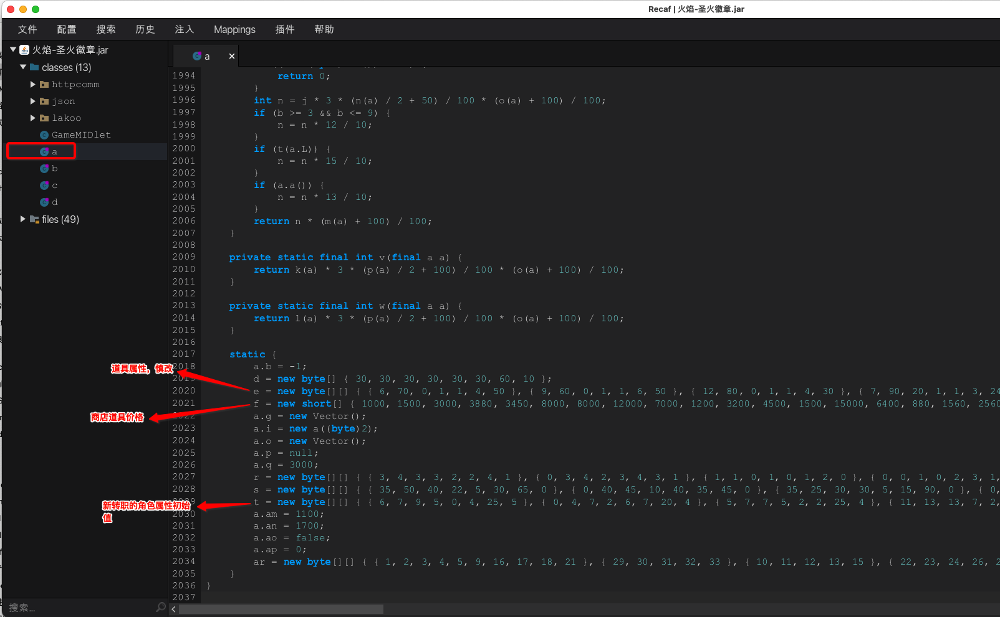
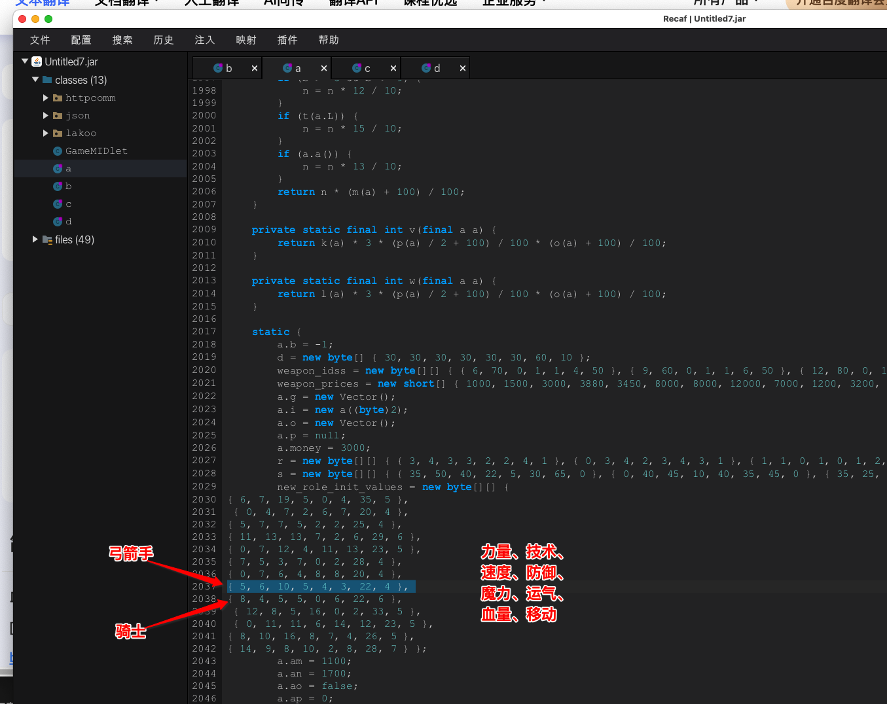

---
敌方人物的初始值属性 

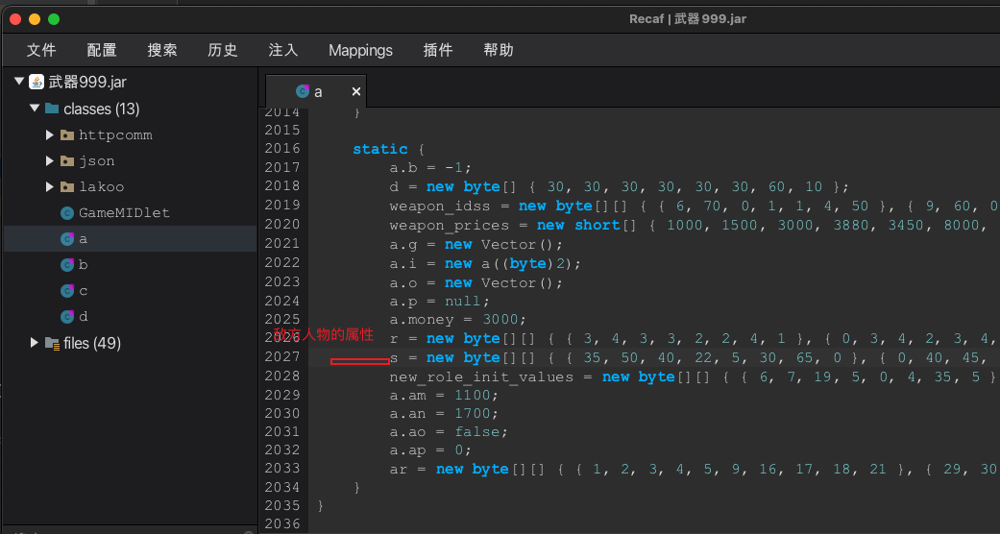


---
角色获得的经验


---
根据获得的经验判断角色升级
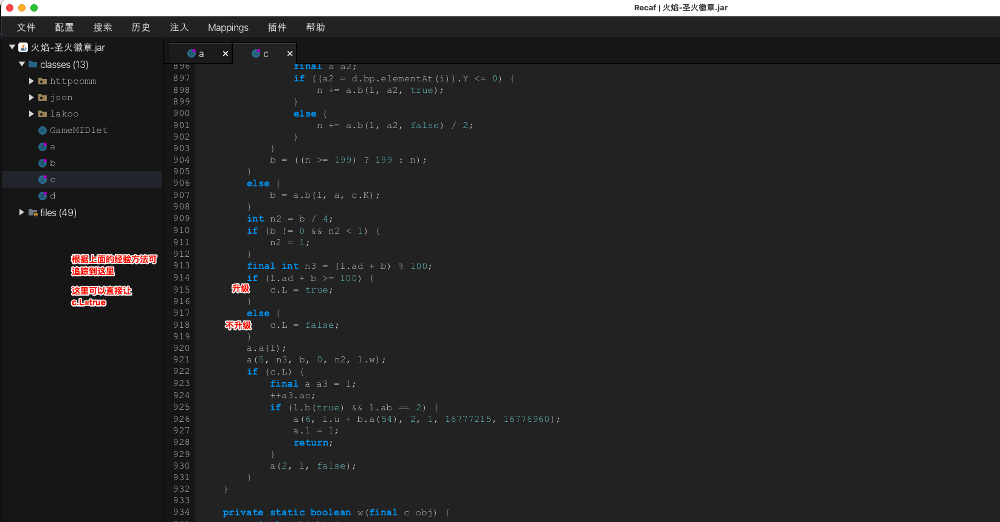


---
升级后，需要增加的属性增加多少值
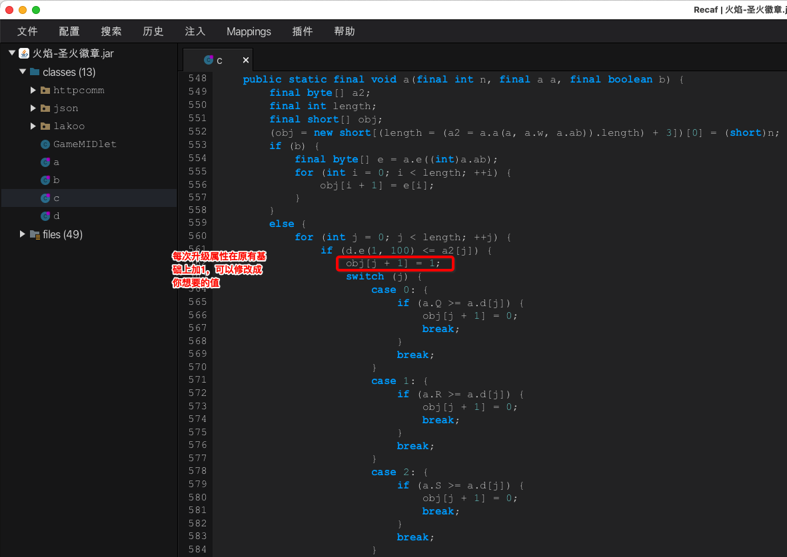

---
进商店更快些
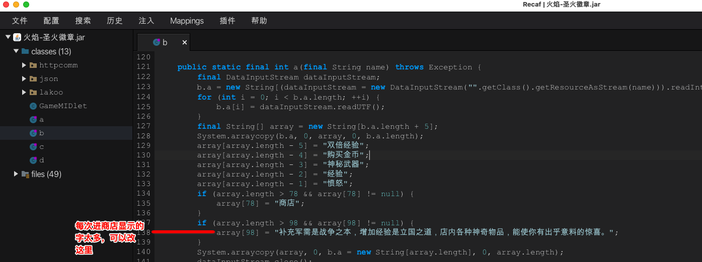

---
点购买金币，加多少钱
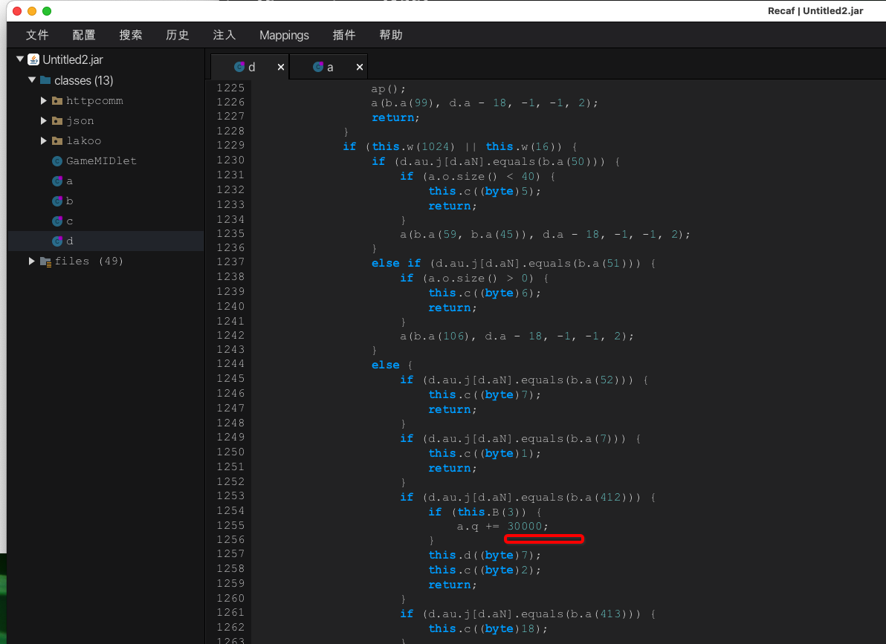

---
武器耐久度

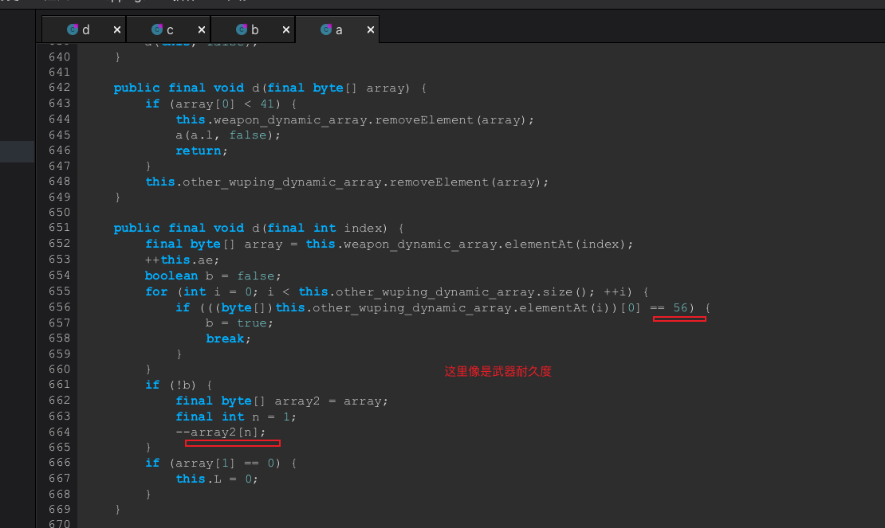

--- 
商店整装装备个数限制
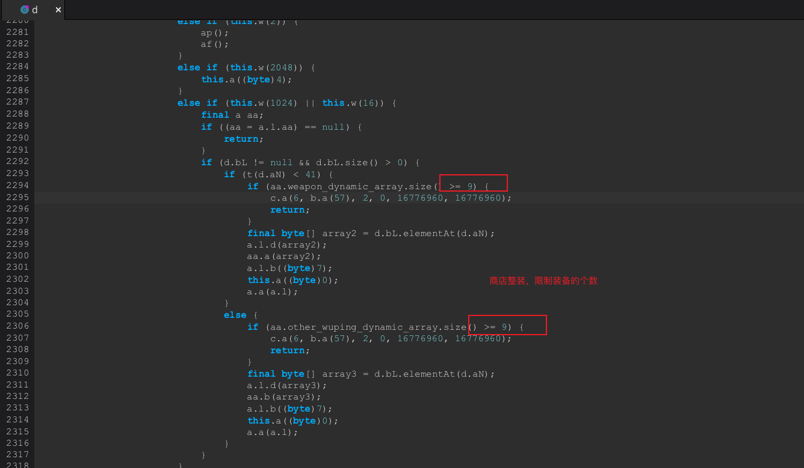

---
给予或者访问房子获取物品个数限制
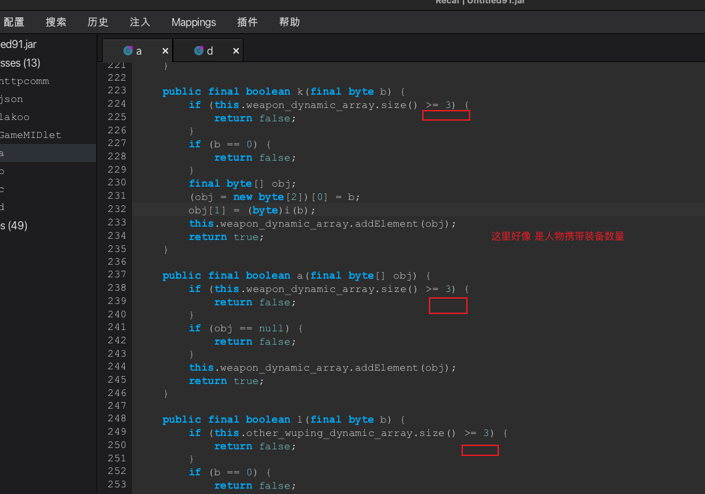

---
往往地图上加入敌军
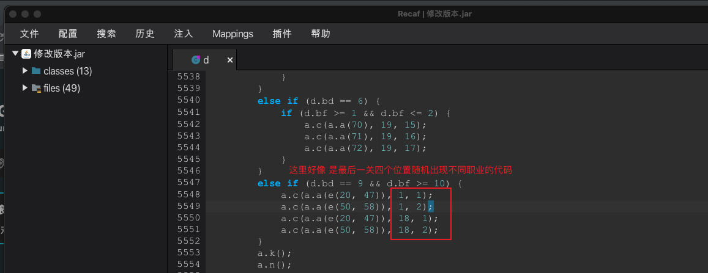

---
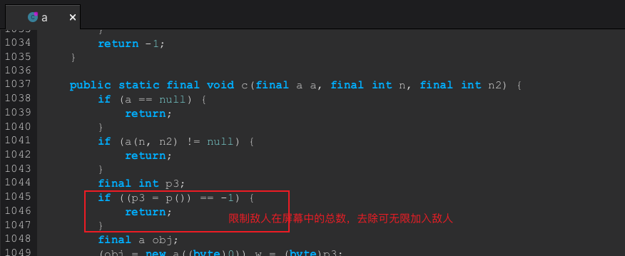

---
游戏通关结束时，显示名字等级战力
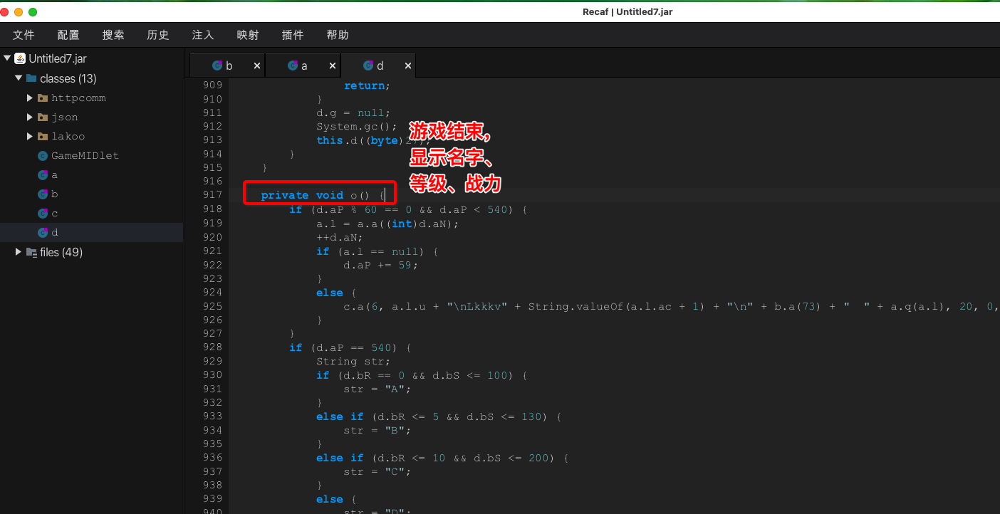


---
对于有些角色比如雅木跟希尔克找不到初始属性修改，只能尝试修改存档

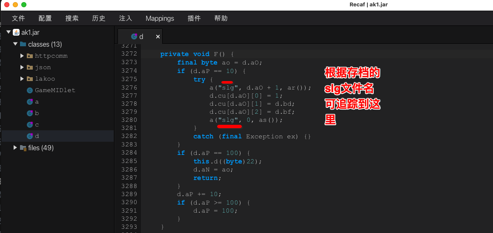

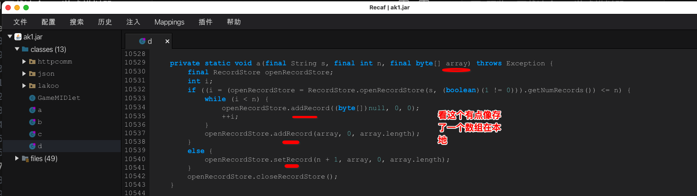
那么问题来了，为了验证存的是啥，就得写个打印数组的方法的代码，然后手机连上`Android Studio`,看打印结果

---
新建安卓项目，
把代码复制进去，让其不报错，
```java
private static void a(final String s, final int n, final byte[] array) throws Exception {
        final RecordStore openRecordStore;
        int i;
        if ((i = (openRecordStore = RecordStore.openRecordStore(s, (boolean)(1 != 0))).getNumRecords()) <= n) {
            while (i < n) {
                openRecordStore.addRecord((byte[])null, 0, 0);
                ++i;
            }
            openRecordStore.addRecord(array, 0, array.length);
        }
        else {
            openRecordStore.setRecord(n + 1, array, 0, array.length);
        }
        openRecordStore.closeRecordStore();
        // 这里我们要追加打印这个数组
        final StringBuffer x = new StringBuffer();
        for (int j = 0; j < array.length; ++j) {
            x.append("--"+array[j]);
        }
        System.out.println(x);
    }
```

然后再生成apk,找出dex

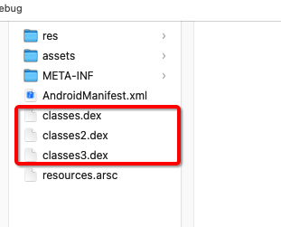

再用`dex-tools-2.1`，用`./d2j-dex2jar.sh classes3.dex`命令转换化jar
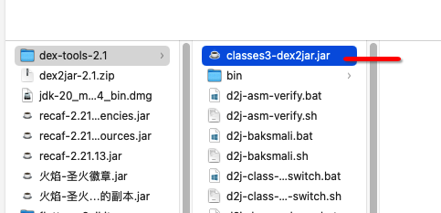


,再用`Recaf`查看打印代码的字节码，再拷贝到`火焰-圣火徽章.jar`所需的方法中的字节码中,新加入的字节码得修改下，最后的全代码如下
```java
// 原方法代码
private static void a(final String s, final int n, final byte[] array) throws Exception {
        final RecordStore openRecordStore;
        int i;
        if ((i = (openRecordStore = RecordStore.openRecordStore(s, (boolean)(1 != 0))).getNumRecords()) <= n) {
            while (i < n) {
                openRecordStore.addRecord((byte[])null, 0, 0);
                ++i;
            }
            openRecordStore.addRecord(array, 0, array.length);
        }
        else {
            openRecordStore.setRecord(n + 1, array, 0, array.length);
        }
        openRecordStore.closeRecordStore();
         // 这里我们要追加打印这个数组
        final StringBuffer x = new StringBuffer();
        for (int j = 0; j < array.length; ++j) {
            x.append("--" + array[j]);
        }
        System.out.println(x);
    }
// java字节码
DEFINE PRIVATE STATIC a(Ljava/lang/String; 0, I 1, [B 2)V
THROWS java/lang/Exception
A:
ALOAD 0
ICONST_1
INVOKESTATIC javax/microedition/rms/RecordStore.openRecordStore(Ljava/lang/String;Z)Ljavax/microedition/rms/RecordStore;
DUP
ASTORE 3
INVOKEVIRTUAL javax/microedition/rms/RecordStore.getNumRecords()I
DUP
ISTORE 4
ILOAD 1
IF_ICMPGT D
B:
ILOAD 4
ILOAD 1
IF_ICMPGE C
ALOAD 3
ACONST_NULL
ICONST_0
ICONST_0
INVOKEVIRTUAL javax/microedition/rms/RecordStore.addRecord([BII)I
POP
IINC 4 1
GOTO B
C:
ALOAD 3
ALOAD 2
ICONST_0
ALOAD 2
ARRAYLENGTH
INVOKEVIRTUAL javax/microedition/rms/RecordStore.addRecord([BII)I
POP
GOTO E
D:
ALOAD 3
ILOAD 1
ICONST_1
IADD
ALOAD 2
ICONST_0
ALOAD 2
ARRAYLENGTH
INVOKEVIRTUAL javax/microedition/rms/RecordStore.setRecord(I[BII)V
E:
ALOAD 3
INVOKEVIRTUAL javax/microedition/rms/RecordStore.closeRecordStore()V
// 这里是我们加入的打印数组的字节码
NEW java/lang/StringBuffer
DUP
INVOKESPECIAL java/lang/StringBuffer.<init>()V
ASTORE 0
ICONST_0
ISTORE 3
F:
ILOAD 3
ALOAD 2
ARRAYLENGTH
IF_ICMPGE G
ALOAD 0
NEW java/lang/StringBuilder
DUP
INVOKESPECIAL java/lang/StringBuilder.<init>()V
LDC "--"
INVOKEVIRTUAL java/lang/StringBuilder.append(Ljava/lang/String;)Ljava/lang/StringBuilder;
ALOAD 2
ILOAD 3
BALOAD
INVOKEVIRTUAL java/lang/StringBuilder.append(I)Ljava/lang/StringBuilder;
INVOKEVIRTUAL java/lang/StringBuilder.toString()Ljava/lang/String;
INVOKEVIRTUAL java/lang/StringBuffer.append(Ljava/lang/String;)Ljava/lang/StringBuffer;
POP
IINC 3 1
GOTO F
G:
GETSTATIC java/lang/System.out Ljava/io/PrintStream;
ALOAD 0
INVOKEVIRTUAL java/io/PrintStream.println(Ljava/lang/Object;)V
RETURN
H:
I:

```

---
连上`Android Studio`,看打印结果。
操作下角色，点存储进度，就会有打印了

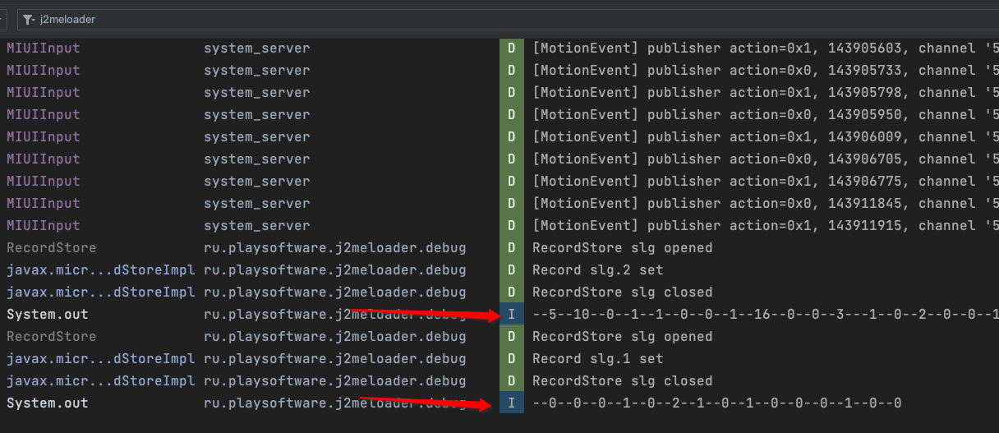
后面就研究这个数组，就实现了修改存档了

---
终于看懂了这啥参数调用
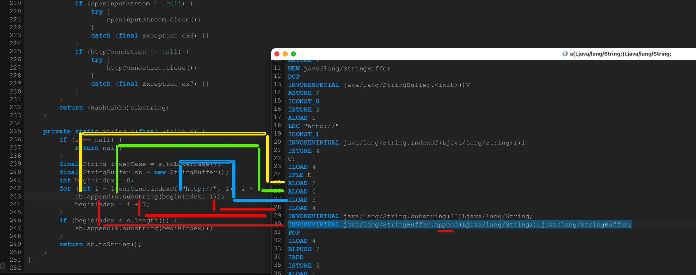


